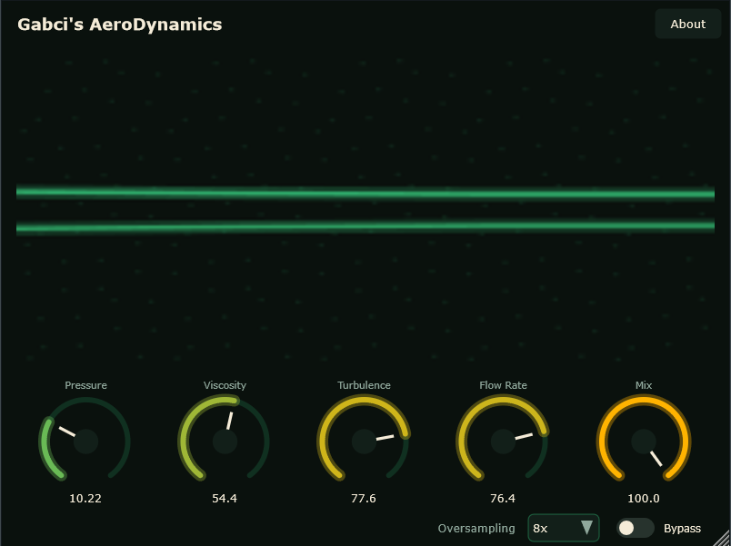
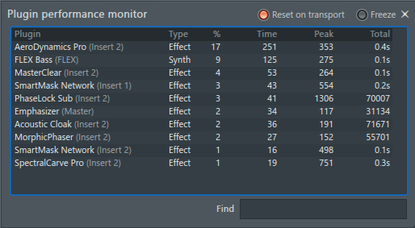

# Gabci's AeroDynamics Pro

> Folyadékmechanikai torzító, a Burgers-egyenlet numerikus megoldására építve.

[](LICENSE)
[](https://github.com/rcptr2/gabcis-aerodynamics-pro/actions/workflows/build.yml)


🇬🇧 *English documentation: [README.md](README.md)*



*A folyadék-megjelenítő az öt motorszabályzó fölött, jobbra lent a túlmintavételezés-választó.*

A legtöbb szaturációs plugin statikus átviteli görbével formálja a hullámalakot. Az AeroDynamics Pro
ehelyett egydimenziós összenyomható áramlásként kezeli a jelet, és a viszkózus **Burgers-egyenlet**
numerikus megoldásán lépteti végig — ez a legegyszerűbb parciális differenciálegyenlet, amely valódi
hullámmeredekedést és lökéshullám-képződést produkál. A felharmonikusok a fizika következményei, nem
egy kézzel rajzolt görbéé, ezért együtt mozognak az anyaggal.

[JUCE](https://juce.com) alapon készült. A `processBlock` az audioszálon allokációmentes.

## Hogyan működik

A motor **operátor-szétválasztást** (operator splitting) használ, szétbontva az egyenlet két felét,
amelyek ellentétes numerikus kezelést kívánnak:

- **A lineáris szállítást (Flow Rate)** egy Lagrange-interpolált `juce::dsp::DelayLine` végzi a
  túlmintavételezett rátán, legfeljebb 25 ms-ig. Mivel csak egy interpolált korábbi mintát olvas be,
  nulla numerikus diffúziót visz be — a korábbi, egyetlen rácson dolgozó megoldás akkor is elkente a
  jelet, ha minden effekt-szabályzó nullán állt.
- **A nemlineáris rész** — `∂u/∂t + α·u·∂u/∂x = ν·∂²u/∂x²` — kis, fix méretű differenciarácson fut,
  és ez adja a hullámmeredekedést (Turbulence) és a viszkózus csillapítást (Viscosity) a szállítási
  tag mellékhatásai nélkül.

A mag körül:

- **Túlmintavételezés** — 4× vagy 8× equiripple FIR félsávos láncok, előre felépítve a
  `prepareToPlay()`-ben, maximális minőségre állítva. Az aliasing tönkreteszi a turbulencia-tag
  organikus jellegét, ezért ez nem opcionális.
- **Stabilitás** — az együttható-korlátok a séma legrosszabb esetű (Nyquist/sakktábla) módusának
  csatolt von Neumann-analíziséből származnak, nem külön CFL-feltételekből.
- **DC-blokkoló** és latenciakompenzált száraz út, amely lineáris Mix-keresztfakulásba fut.

## Paraméterek

| Paraméter | Tartomány | Alapérték | Leírás |
|---|---|---|---|
| Pressure | 0 – 36 dB | 0 dB | Előerősítés a motor elé. Ez hajtja mélyen a nemlineáris tartományba a jelet — messze a leghallhatóbb szabályzó. |
| Viscosity | 0 – 100 % | 30 % | Viszkózus csillapítási tag (ν). Simítja az áramlást. |
| Turbulence | 0 – 100 % | 30 % | Nemlineáris advekciós tag (α). Ez adja a hullámmeredekedést. |
| Flow Rate | 0 – 100 % | 50 % | Szállítási késleltetés, 0 – 25 ms-ra leképezve a túlmintavételezett rátán. |
| Mix | 0 – 100 % | 100 % | Száraz/nedves keverés latenciakompenzált száraz úttal. |
| Oversampling | 4× / 8× | 8× | Antialiasing-minőség. |
| Bypass | be / ki | ki | Teljes kihagyás. |

## Állapot — béta

Ez a **0.6.1-es verzió, előzetes kiadás**. Stabil, és a tesztkészlete zöld, de a v0.6.0-s
architektúraváltás (a fent leírt operátor-szétválasztás) a szándékoltnál finomabbra hagyta a
Viscosity és Turbulence szabályzókat tipikus jelszinteken, a Flow Rate pedig már tiszta késleltetés,
nem karakterszabályzó. A Pressure maradt a domináns paraméter. Az 1.0.0-s verzió teljes élő
tesztkörre vár; részletek a [CHANGELOG.md](CHANGELOG.md)-ben.

Ha látványos mozgást szeretnél a Viscosity és Turbulence szabályzóktól, előbb emeld a Pressure-t.

## Telepítés

A kész binárisok a [Releases](https://github.com/rcptr2/gabcis-aerodynamics-pro/releases)
oldalon találhatók.

### Windows x64

1. Töltsd le az `AeroDynamicsPro-vX.Y.Z-Windows-x64-VST3.zip` fájlt.
2. Csomagold ki, és másold az `AeroDynamics Pro.vst3` mappát ide: `C:\Program Files\Common Files\VST3\`.
3. Futtass plugin-újrakeresést a DAW-odban.

### macOS (Intel)

A macOS bináris **x86_64 (Intel)**. Intel Maceken natívan fut, Apple Siliconon Rosetta 2-vel, Intel
módban futó hosztban; arm64 változat nincs.

1. Töltsd le az `AeroDynamicsPro-vX.Y.Z-macOS-Intel-VST3.zip` fájlt.
2. Csomagold ki, és másold az `AeroDynamics Pro.vst3`-at ide: `/Library/Audio/Plug-Ins/VST3/`
   (vagy `~/Library/Audio/Plug-Ins/VST3/`, ha csak a saját felhasználódnak kell).
3. A build nincs notarizálva, ezért töröld róla a karantén jelzőt:
   ```bash
   xattr -dr com.apple.quarantine "/Library/Audio/Plug-Ins/VST3/AeroDynamics Pro.vst3"
   ```
4. Futtass plugin-újrakeresést a DAW-odban.

## Fordítás forrásból

### Követelmények

- CMake 3.24 vagy újabb
- C++20-as fordító — Windowson **Visual Studio 2022** („Desktop development with C++"),
  macOS-en **Xcode 15+**
- Git

A JUCE 9.0.0 verziója rögzítve van a `CMakeLists.txt`-ben, és a CMake `FetchContent` konfiguráláskor
automatikusan letölti. MinGW nem támogatott: a JUCE kifejezetten tiltja, és a Windows-backendje
MSVC-intrinsiceket, valamint a Direct2D/DirectWrite fejléceket igényel.

> **A build-mappa útvonalában nem lehet aposztróf.** A JUCE által generált VST3 `POST_BUILD` lépések
> nem escape-elik az aposztrófot az általuk kiadott shell-parancsláncokban. A `CMakeLists.txt` ezt
> ellenőrzi, és érthető hibaüzenettel áll le ahelyett, hogy később hasalna el. Ezért is
> „AeroDynamics Pro" a csomag neve, míg a képernyőn megjelenő név „Gabci's AeroDynamics".

### Windows

```bash
cmake -S . -B build -G "Visual Studio 17 2022" -A x64 -DAERODYNAMICSPRO_BUILD_TESTS=OFF
cmake --build build --config Release --target AeroDynamicsProPlugin_VST3
```

### macOS

```bash
cmake -S . -B build -G Xcode -DCMAKE_OSX_ARCHITECTURES=x86_64 -DAERODYNAMICSPRO_BUILD_TESTS=OFF
cmake --build build --config Release --target AeroDynamicsProPlugin_VST3
```

A kész csomag ide kerül:
`build/AeroDynamicsProPlugin_artefacts/Release/VST3/AeroDynamics Pro.vst3`.

### Tesztek

A tesztkészlet [Catch2](https://github.com/catchorg/Catch2)-t használ (automatikusan letöltődik):

```bash
cmake -S . -B build -DAERODYNAMICSPRO_BUILD_TESTS=ON
cmake --build build --config Release --target AeroDynamicsProTests
```

Ezután futtasd a build-fából a keletkező `AeroDynamicsProTests` futtathatót.

## Mappastruktúra

```
Source/          A plugin forrása — processzor, szerkesztő, folyadékmotor, túlmintavételező,
                 DC-blokkoló, vizualizáló, megjelenés
Tests/           Catch2 egységtesztek
docs/            Tervezési blueprint
CMakeLists.txt   Build-definíció; rögzíti a JUCE 9.0.0-t
CHANGELOG.md     Fejlesztési előzmények fázisonként
```

## Tesztelve

- **macOS** (Intel, x86_64) — FL Studio 2026
- **Windows 11 x64** — FL Studio 2026

## Teljesítmény



FL Studio 2026-ban mérve, Windows 11 x64 alatt, egy ASUS ZenBook 13-on, Intel
Core i7-1065G7 processzorral — ez egy alacsony fogyasztású, négymagos laptop-CPU,
nem munkaállomás. Mind a hét plugin egyszerre futott ugyanabban a projektben, két
gyári Image-Line pluginnal együtt, viszonyítási alapnak. A számok az FL Studio
sajátjai, *Reset on transport* bekapcsolva, hogy az egyszeri indulási tüskék
kimaradjanak.

| Plugin | CPU % | Time | Peak |
|---|---:|---:|---:|
| **Gabci's AeroDynamics Pro** | **17** | **251** | **353** |
| FLEX Bass *(Image-Line, viszonyítás)* | 9 | 125 | 275 |
| Gabci's MasterClear | 4 | 53 | 264 |
| Gabci's SmartMask Network *(1. példány)* | 3 | 43 | 554 |
| Gabci's PhaseLock Sub | 3 | 41 | 1306 |
| Emphasizer *(Image-Line, viszonyítás)* | 2 | 34 | 117 |
| Gabci's Acoustic Cloak | 2 | 36 | 191 |
| Gabci's MorphicPhaser | 2 | 27 | 152 |
| Gabci's SmartMask Network *(2. példány)* | 1 | 16 | 498 |
| Gabci's SpectralCarve Pro | 1 | 19 | 751 |

## Licenc

**GNU Affero General Public License v3.0 vagy újabb** alatt jelenik meg — lásd a [LICENSE](LICENSE)
fájlt.

Ez a választás nem önkényes. Az AeroDynamics Pro JUCE 9-cel készült, amely kettős licencű: AGPLv3
vagy kereskedelmi JUCE-licenc. Az AGPLv3 ág az, ami ingyenesen engedi a forrásból épített bináris
terjesztését — cserébe minden származtatott művet ugyanezen feltételek alatt, elérhető forrással kell
kiadni.

## Attribúció

- [JUCE](https://juce.com) — © Raw Material Software Limited, itt AGPLv3 alatt használva.
- [Catch2](https://github.com/catchorg/Catch2) — Boost Software License 1.0 (csak teszt-buildekhez).
- A VST® a Steinberg Media Technologies GmbH bejegyzett védjegye. A JUCE-szal szállított VST 3 SDK-t
  a Steinberg MIT licenc alatt terjeszti.

## Szerző

Tomori Gábor — *Gabci Audio*
